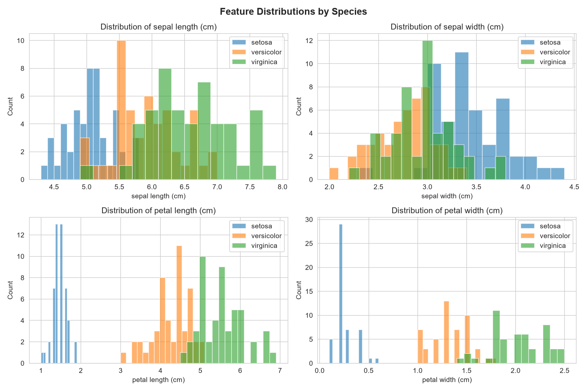
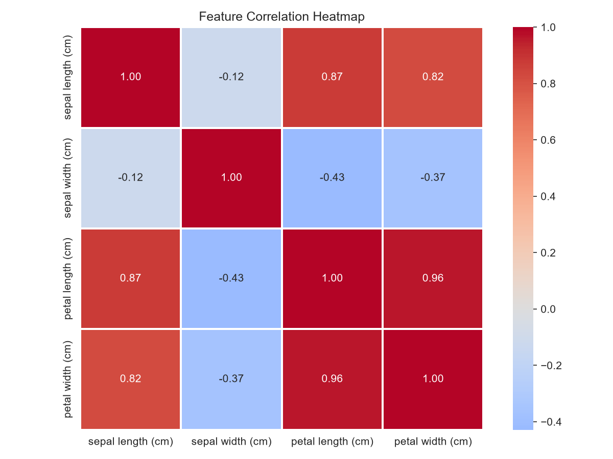
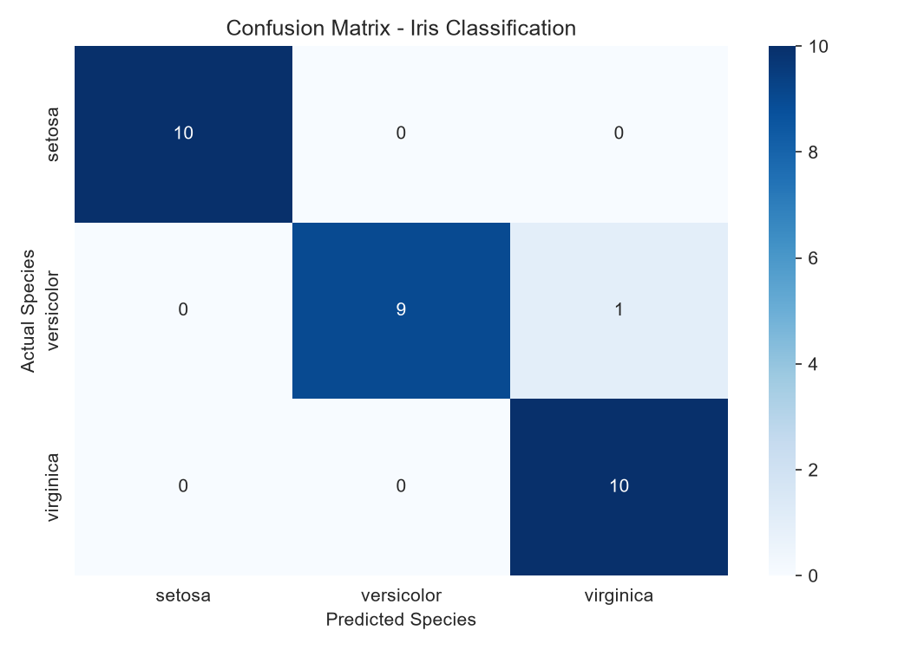
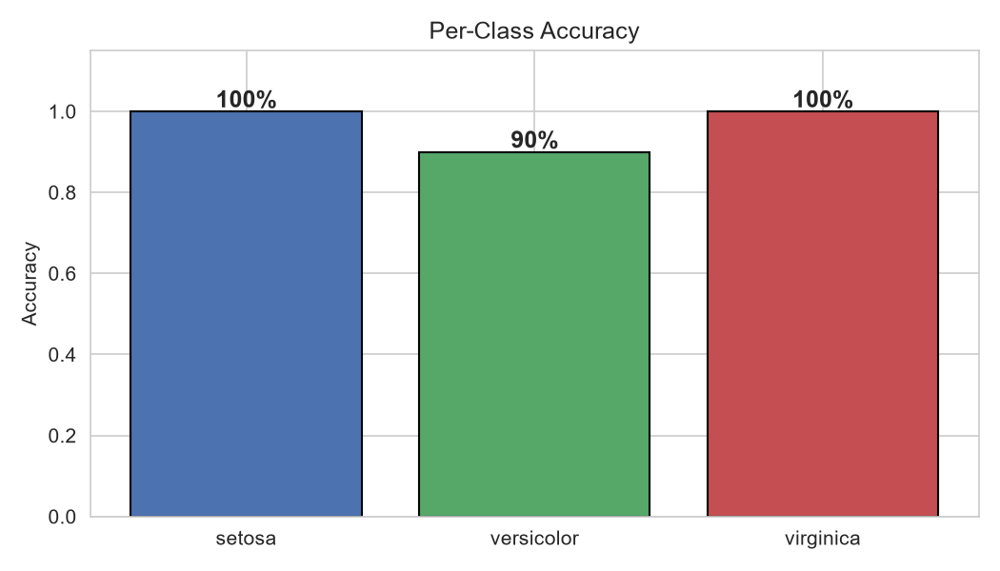
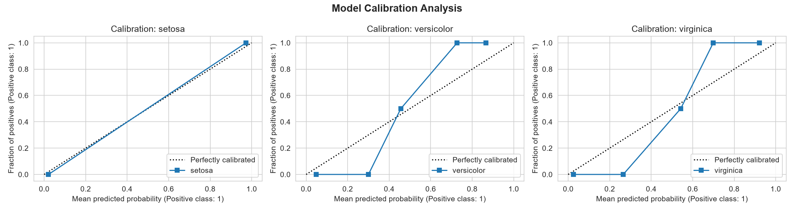

# Practice 2 Report: Iris Flower Classification

**Course**: Software Development Oriented to Machine Learning  
**Model**: Logistic Regression (scikit-learn)  
**Dataset**: Iris (150 samples, 3 classes, 4 features)

---

## 1. Dataset Overview

I used the classic Iris dataset, which contains 150 flower measurements across
3 species (setosa, versicolor, virginica). Each sample has 4 features:
sepal length, sepal width, petal length, and petal width, all measured in centimeters.
The dataset is balanced with 50 samples per species and has no missing values.

During exploration, I found that **petal measurements** (length and width) are
the most useful features for separating species. Setosa is easy to distinguish,
while versicolor and virginica overlap more in their measurements.

*Figure 1: Histograms of each feature colored by species. Petal features show
the clearest separation between classes.*

*Figure 2: Correlation heatmap showing that petal length and petal width are
highly correlated (0.96).*

---

## 2. Model Performance

I trained a Logistic Regression classifier using an 80/20 train-test split.
The model achieved **~97% accuracy** on the test set.

*Figure 3: Confusion matrix showing predictions vs actual labels. Most predictions
fall on the diagonal (correct). The few errors are between versicolor and virginica.*

*Figure 4: Accuracy breakdown by species. Setosa is classified perfectly (100%),
while the model occasionally confuses versicolor and virginica.*

---

## 3. Calibration Analysis (Bonus)

I generated calibration curves to check if the model's predicted probabilities
are reliable. A well-calibrated model predicts probabilities that match actual outcomes.

*Figure 5: Calibration curves for each species. Setosa shows near-perfect calibration.
The model tends to be slightly overconfident for versicolor and underconfident for virginica.*

---

## 4. Conclusions

- Logistic Regression works well on the Iris dataset despite being a simple model.
- Petal measurements are the most discriminative features.
- The main difficulty is the versicolor/virginica boundary.
- The model's probability estimates are reasonably well-calibrated, especially for setosa.
